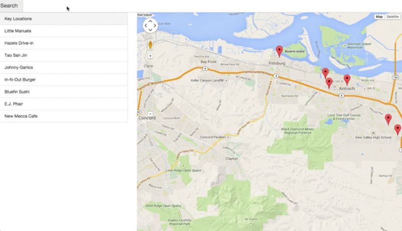
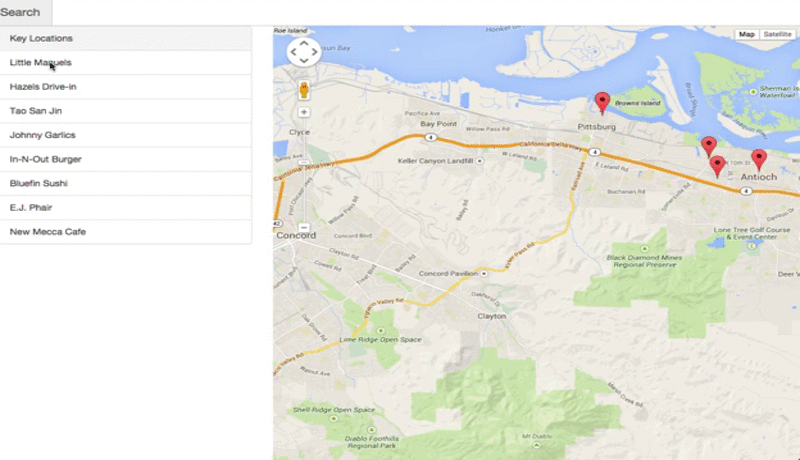

**Output - Neighborhood Map**
----------
You will develop a single-page application featuring a map of your neighborhood or a neighborhood you would like to visit. You will then add additional functionality to this application, including: map markers to identify popular locations or places you’d like to visit, a search function to easily discover these locations, and a listview to support simple browsing of all locations. You will then research and implement third-party APIs that provide additional information about each of these locations (such as StreetView images, Wikipedia articles, Yelp reviews, etc).

### Functionality
 First and foremost we need to make sure we include the 3 main components A Search bar, a list view, and a map. Notice our map has markers and the list view contains the names of each of the locations on our map.

Now for basic functionality we need to make sure to that our search filters BOTH our list view and our map markers. We are only looking for a basic search functionality, so it only needs to be able to search by name. Feel free though to modify the filter to search for location type or other information.

Along with our list and markers filtering based on our search bar, they should also both be clickable. When we click a list item it should move towards the marker and open an info window. Clicking on a marker should also open an info window. The content of the info window is up to you but it would be a good chance to include an API! Notice as well that our markers animate to draw our users attention to that marker.

### Steps to follow to complete this Project?

1.  Write code required to add a full-screen map to your page using the Google Maps API. For sake of efficiency, the map API should be called only once.
2.  Write code required to display map markers identifying a number of locations you are interested in within this neighborhood. This is the set of locations on which you will be searching and filtering in step 5. Your project should include at least 5 locations and display those locations when the page is loaded.
3. Implement input text area to filter your map markers displayed in step 2. The input text area should filter on markers that already show up. Simply providing a search function through a third-party API and displaying the results is not enough.
4. Implement a list view of the set of locations defined in step 2, filtering the locations via the input text area will filter the list view and map marker locations accordingly.
5. Add functionality using third-party APIs to provide information when a map marker or list view entry is clicked (ex. Yelp reviews, Wikipedia, Flickr images, etc). Note that StreetView and Places don't count as an additional 3rd party API because they are libraries included in the Google Maps API. 
6. Add additional functionality to animate a map marker when either the list item associated with it or the map marker itself is selected.
7. Add additional functionality to open an infoWindow with the information described in step 5 when either a location is selected from the list view or its map marker is selected directly.
8. Interface should be very intuitive to use. For example, the input text area to filter locations should be easy to locate. It should be easy to understand what set of locations is being filtered. Selecting a location via list item or map marker should cause the map marker to bounce or in some other way animate to indicate that the location has been selected and associated info window opens above map marker with additional information.
9. We expect your application to provide a filter option on the map markers displayed by default on load. The list view and the markers should update accordingly in real-time. Providing a search function through a third-party API is not enough to meet specifications.
10. Error Handling: In case of error (e.g. in a situation where a third party api does not return the expected result) we expect your webpage to do one of the following: A message is displayed notifying the user that the data can't be loaded, OR There are no negative repercussions to the UI. Note: Please note that we expect you to handle errors if the browser has trouble initially reaching the 3rd-party site as well. For example, imagine a user is using your neighborhood map, but her firewall prevents her from accessing the Instagram servers. Here is a reference article on [how to block websites](http://www.digitaltrends.com/computing/how-to-block-a-website/) with the hosts file. It is important to handle errors to give users a consistent and good experience with the webpage. Read [this blogpost](http://ruben.verborgh.org/blog/2012/12/31/asynchronous-error-handling-in-javascript/) to learn more .Some JavaScript libraries provide special methods to handle errors. For example: refer to .fail() method discussed here if you use jQuery's ajax() method. We strongly encourage you to explore ways to handle errors in the library you are using to make API calls.

### The Rubric

#### Interface Design

All application components render on-screen in a responsive manner, usable across modern desktop, tablet, and phone browsers

Application must be very responsive. The best way to begin making the interface responsive is that you design for mobile first. Build it small then make it big! If you have time/internet, take a look at a course on [Responsive Web Design](https://www.udacity.com/course/responsive-web-design-fundamentals--ud893) that will teach you a lot of great ways to make things responsive.

#### App Functionality

All application components function appropriately without error.

This is what is shown above, make sure that the search bar, list view, and map. If you do add additional components these also must function as well. Adding half-built additional functionality will lead to not meeting specifications.

#### Asynchronous Data Usage

Application utilizes Google's Map API and at least one additional third-party "data API". All data requests are retrieved in an asynchronous manner. In the event of a failed data retrieval errors are handled gracefully.

So we require that you utilize Google's Map API. The main thing we want to point out here that you must make sure that if the data retrieval fails you indicate to the user that such a problem has occured. The user should not be left guessing why something is not working. To test the functionality of failed data requests you can simply disconnect from the internet.

#### API's We Recommend

- Yelp's API 
- Instagram's API 
- Foursquare's API 
- Wikipedia's API