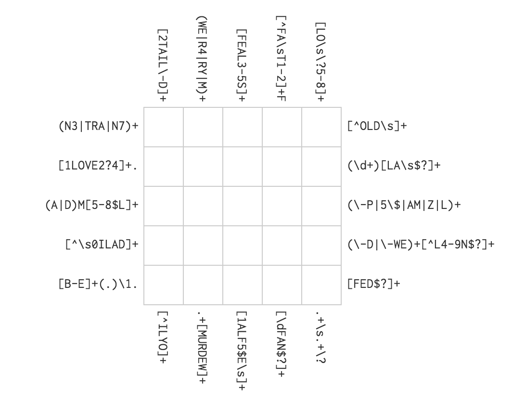
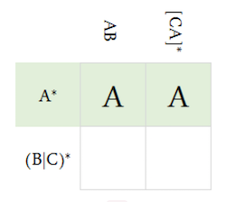
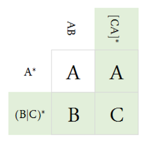

**Output**
----------
After attaining this skill, and as a demonstration of it, a person should be able to solve the following crossword puzzle:

***Instructions***
------------------

Regex Crossword is a game similar to sudoku or the traditional crossword puzzle, where you must guess the correct letters in the horizontal and vertical lines of a grid. In Regex Crossword you are not given a word to guess, but a pattern that tells you which letters are allowed.

Let's walk through a test example, just to get the hang of it. Given the following Regex Crossword puzzle, you first need to look at the patterns, and see if there are some of them, that can only have one solution.

If we look at the first "clue" A*, it means that the first row can have zero or more A's. No other letters are allowed, so we just write A's all the way. That was easy!

If we then look at the clue in the first column, AB is actually literally an A followed by B. We already have the A, so we add the B in the last position.

Now we only need to fill in the last position, but the last two clues are a bit more tricky. [CA]* means that the range of letters C or A can occur zero or more times. The | symbol means or, so (B|C)* will match the letter B or C zero or more times. If we look at the last column, we already have an A in the first position, and the last position can be either C or A. But the clue in the last row only allow a B or C. Thus a C is the only letter we can put in the last position. Success - we have now solved the puzzle!

